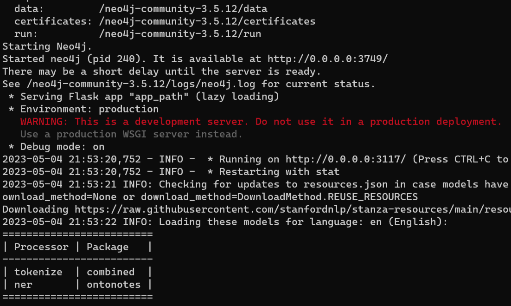
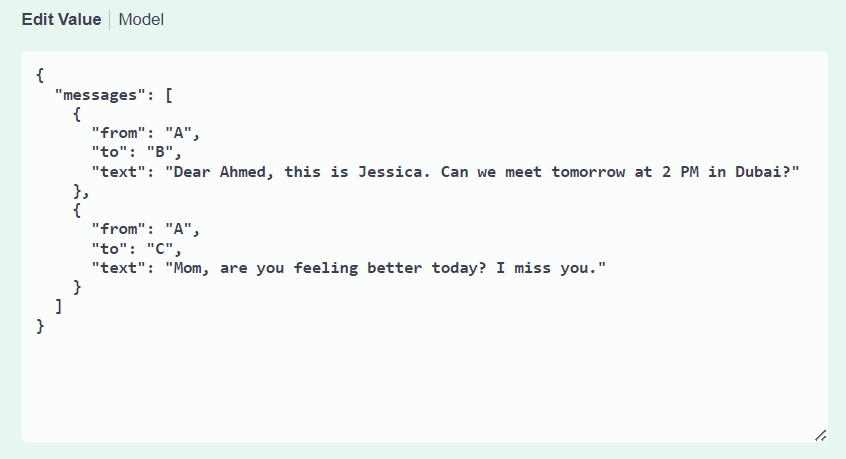
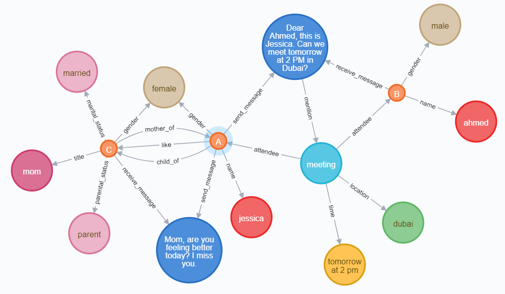

# message intelligence platform


# start docker instance

open a command prompt and copy and paste the following command

```bash
docker run -it ^
-p 0.0.0.0:3677:3677 ^
-p 0.0.0.0:3749:3749 ^
-p 0.0.0.0:3117:3117 ^
jingyanwang1/message_intelligence:2.0.5 
```




# input interface: 

http://localhost:3117




# output interface: 

http://localhost:3749/


